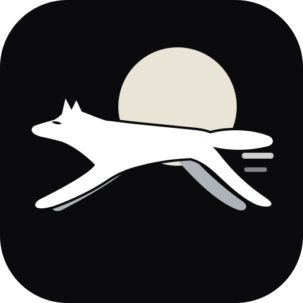

# Sklandus

*Sklandus* is Lithuanian for "smooth, flowing", from the same root as *sklandyti*,
to glide.

A Mac and iPad app showing Vilnius buses, trolleybuses and ferries moving live on a
map. macOS 26 / iPadOS 26, native frameworks only.

**Status:** being built step by step. Nothing to run yet.

- [`docs/SPIKE-FINDINGS.md`](docs/SPIKE-FINDINGS.md): what the prototype proved about
  the data, the feeds, rendering and performance. Read this first.
- [`AGENTS.md`](AGENTS.md): coding conventions for this project.
- [`design/icon/`](design/icon/): the working app icon.
- The prototype itself is preserved at the `spike` tag: `git checkout spike`.
